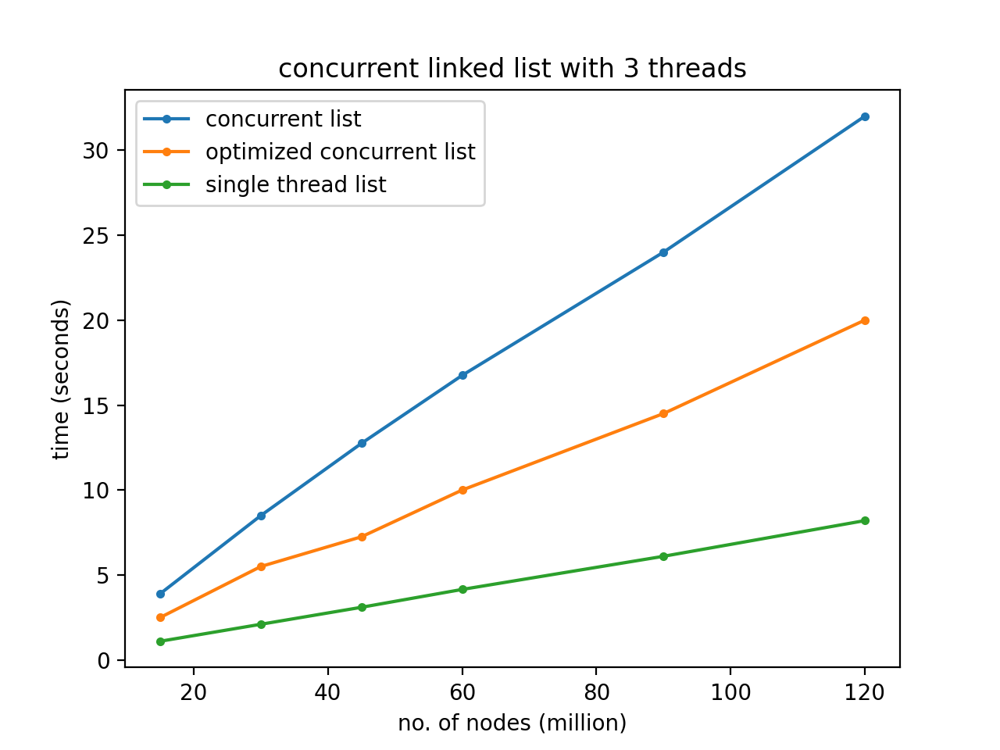

# Concurrency

## Concurrent linked lists

in this directory i have three very minimal linked lists programs for the epurpose of testing the timing using multi-threaded linked lists. All three use the same list structure however one is single-threaded, or normal, to compare the others to. another uses three threads and locks, and the third also used three thread and locks but is optimized.  

I've tested it by just creating nodes and placing them to the front of the list and i've plotted the results. as you can see, as the numbers of nodes gets higher, there is a larger and larger time disparity between the lists.   
 
## Timing of inserting nodes to head of a linked list
